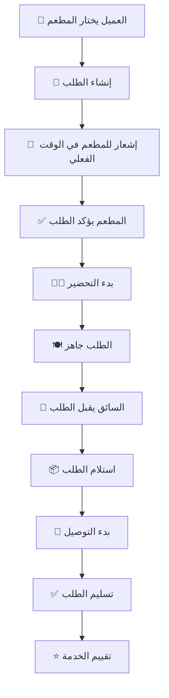

# 🍽️ Eat to Eat - تطبيق توصيل الطعام

تطبيق توصيل الطعام الأسرع والأكثر موثوقية، مبني بـ React و Supabase.

[](https://reactjs.org)
[](https://supabase.com)
[](https://tailwindcss.com)
[](LICENSE)

## ✨ المميزات الرئيسية

### 🎯 للأدوار المختلفة:
- **👥 العملاء**: طلب الطعام، تتبع الطلبات، تقييم المطاعم والسائقين
- **🏪 أصحاب المطاعم**: إدارة المطعم والمنتجات، استقبال الطلبات، تعيين السائقين
- **🚚 السائقين**: استقبال طلبات التوصيل، تحديث حالة التوصيل، تتبع الأرباح
- **👨‍💼 المديرين**: إدارة شاملة للنظام، إحصائيات مفصلة، مراقبة الأداء

### 🚀 المميزات التقنية:
- ✅ واجهة مستخدم حديثة ومتجاوبة مع TailwindCSS
- 🔐 نظام مصادقة آمن مع Supabase Auth
- ⚡ تتبع الطلبات في الوقت الفعلي مع Supabase Realtime
- 🗺️ تكامل مع خرائط Google
- ☁️ رفع الملفات إلى Supabase Storage
- 🔔 نظام إشعارات متقدم
- 📱 تصميم متجاوب لجميع الأجهزة
- 🌍 دعم اللغة العربية والإنجليزية

## 🛠️ التقنيات المستخدمة

### Backend (Supabase):
- **Supabase** - Backend as a Service (BaaS)
- **PostgreSQL** - قاعدة البيانات العلائقية
- **Supabase Auth** - نظام المصادقة الآمن
- **Supabase Realtime** - الإشعارات في الوقت الفعلي
- **Supabase Storage** - تخزين الملفات السحابي
- **Row Level Security (RLS)** - أمان على مستوى قاعدة البيانات

### Frontend:
- **React 18** - مكتبة JavaScript الحديثة
- **Vite** - أداة البناء السريعة
- **TailwindCSS** - إطار CSS المرن
- **React Router** - التنقل بين الصفحات
- **React Query** - إدارة البيانات والحالة
- **Supabase JS** - عميل Supabase
- **Heroicons** - مكتبة الأيقونات

## 🚀 البدء السريع

### 📋 متطلبات النظام:
- Node.js 18+
- npm أو yarn

### ⚡ التثبيت السريع:

```bash
# استنساخ المشروع
git clone <repository-url>
cd eattoeat

# تثبيت التبعيات
npm run install:frontend

# إعداد المشروع
npm run setup

# تشغيل المشروع
npm run dev
```

### 🔧 الإعداد التفصيلي:

#### 1. إنشاء مشروع Supabase:
1. انتقل إلى [supabase.com](https://supabase.com)
2. أنشئ حساب جديد أو سجل الدخول
3. أنشئ مشروع جديد
4. انتظر حتى يكتمل الإعداد

#### 2. إعداد قاعدة البيانات:
1. افتح Supabase Dashboard > SQL Editor
2. انسخ محتوى `database/supabase_schema.sql`
3. الصق في SQL Editor واضغط Run

#### 3. إعداد Storage:
1. اذهب إلى Storage في Supabase Dashboard
2. أنشئ bucket جديد باسم `avatars`
3. أنشئ bucket جديد باسم `images`
4. عيّن السياسات: Public Read, Authenticated Write

#### 4. إعداد Frontend:
```bash
cd frontend
npm install
cp .env.example .env
```

5. أضف قيم Supabase إلى `.env`:
```env
VITE_SUPABASE_URL=https://your-project.supabase.co
VITE_SUPABASE_ANON_KEY=your-anon-key-here
```

6. شغّل المشروع:
```bash
npm run dev
```

## 🔧 إعداد الخدمات الخارجية

### 🗺️ Google Maps API:
1. انتقل إلى [Google Cloud Console](https://console.cloud.google.com/)
2. أنشئ مشروع جديد أو اختر مشروع موجود
3. فعّل Google Maps JavaScript API
4. أنشئ API Key
5. أضف المفتاح إلى ملف `.env`:
```env
VITE_GOOGLE_MAPS_API_KEY=your-api-key-here
```

## 📱 الحسابات التجريبية

بعد إعداد Supabase وإنشاء المستخدمين، يمكنك تسجيل الدخول أو إنشاء حسابات جديدة من خلال واجهة التطبيق.

## 🗂️ هيكل المشروع

```
eattoeat/
├── 📁 frontend/               # React App
│   ├── 📁 src/
│   │   ├── 📁 components/     # مكونات React
│   │   │   ├── Auth.jsx       # المصادقة
│   │   │   ├── MenuList.jsx   # قائمة الطعام
│   │   │   ├── Cart.jsx       # سلة التسوق
│   │   │   ├── Checkout.jsx   # إتمام الطلب
│   │   │   └── Profile.jsx    # الملف الشخصي
│   │   ├── 📁 hooks/          # React Hooks
│   │   │   └── useRealtimeOrders.js
│   │   ├── 📁 services/       # خدمات API
│   │   │   └── supabaseApi.js
│   │   ├── 📁 lib/            # مكتبات
│   │   │   └── supabaseClient.js
│   │   └── 📁 pages/          # الصفحات
│   ├── 📁 public/
│   └── 📄 package.json
├── 📁 database/               # مخططات قاعدة البيانات
│   └── supabase_schema.sql
├── 📁 scripts/                # سكريبتات الانتقال
│   └── migrate_mysql_to_postgres.md
├── 📁 templates/              # قوالب
│   └── password_reset_email_ar.txt
├── 📄 docker-compose.yml      # Docker configuration
├── 📄 SUPABASE_MIGRATION_README.md  # دليل الانتقال
├── 📄 MIGRATION_CHECKLIST.md  # قائمة التحقق
└── 📄 README.md
```

## 🔄 سير عمل الطلب



## 🐳 Docker Deployment

### تشغيل مع Docker:
```bash
# بناء وتشغيل الخدمة
docker-compose up -d

# عرض السجلات
docker-compose logs -f

# إيقاف الخدمة
docker-compose down
```

### الخدمات المتاحة:
- 🌐 Frontend: http://localhost:3000

## 📚 التوثيق

- 📖 [دليل الانتقال إلى Supabase](SUPABASE_MIGRATION_README.md)
- ✅ [قائمة التحقق من الانتقال](MIGRATION_CHECKLIST.md)
- 🔄 [دليل تحويل API](API_CONVERSION_GUIDE.md)
- 📋 [ملخص الانتقال](MIGRATION_SUMMARY.md)

## 🧪 الاختبار

```bash
# اختبار Frontend
cd frontend
npm test
```

## 🚀 النشر

### Frontend (React + Vite):
```bash
cd frontend
npm run build
# الملفات المبنية ستكون في مجلد dist/
```

### النشر على Vercel:
1. اربط مستودع GitHub
2. Vercel سيكتشف `vercel.json` تلقائياً
3. أضف متغيرات البيئة في Vercel Settings
4. اضغط Deploy

### النشر على Netlify:
1. اربط مستودع GitHub
2. Build command: `cd frontend && npm run build`
3. Publish directory: `frontend/dist`
4. أضف متغيرات البيئة
5. اضغط Deploy

## 🤝 المساهمة

نرحب بالمساهمات! يرجى:

1. 🍴 عمل Fork للمشروع
2. 🌿 إنشاء فرع للميزة الجديدة (`git checkout -b feature/amazing-feature`)
3. 💾 عمل Commit للتغييرات (`git commit -m 'Add amazing feature'`)
4. 📤 عمل Push للفرع (`git push origin feature/amazing-feature`)
5. 🔄 إنشاء Pull Request

## 📄 الترخيص

هذا المشروع مرخص تحت رخصة MIT - راجع ملف [LICENSE](LICENSE) للتفاصيل.

## 📞 الدعم

للدعم والاستفسارات:
- 📧 البريد الإلكتروني: support@eattoeat.com
- 🐛 الإبلاغ عن الأخطاء: [GitHub Issues](https://github.com/your-repo/issues)

## 🙏 شكر وتقدير

- فريق Supabase على المنصة الرائعة
- فريق React على المكتبة المذهلة
- مجتمع TailwindCSS على التصميم الجميل
- جميع المساهمين في المشروع

---

**تم تطويره بـ ❤️**


# eattoeat2

"# eat_to_eat2" 
